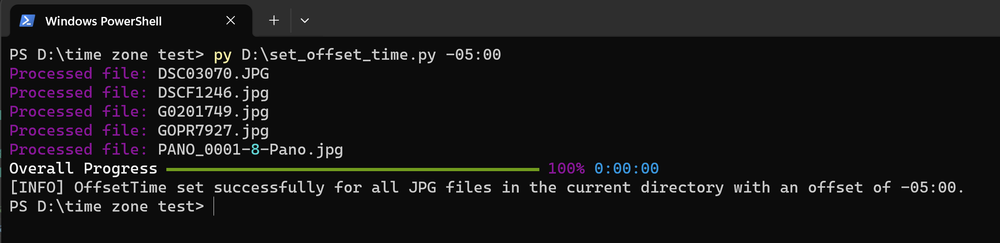

# set_offset_time.py
A simple python script that uses ExifTool by Phil Harvey to adjust the time zone metadata of jpg folders in a directory.

This was born out of a problem encountered when uploading a batch of time adjusted and edited photos from multiple cameras from Lightroom to a shared Google Photos album. The cameras all had different values set for the time zome (EXIF OffsetTime, EXIF OffsetTimeOriginal, EXIF OffsetTimeDigitized). Google Photos uses this value to place photos in chronological order. Without it time synced photos will not appear in the correct order. There is currently (January 2024) no way to set these values using Lightroom or Birdge. 

ExifTool by Phil Harvey is the standard for reading and modifying EXIF data: https://exiftool.org/ so it is used here by way of a subprocess. 
## Installation / Setup
##### You will need to download ExifTool and update set_offset_time.py:18 with it's path on your machine. 
`exiftool_path = r'D:/exiftool.exe'`
##### This script uses rich_ for a progress bar because we are working with photos and things need to be pretty! Install rich:
`python -m pip install rich`

## Usage
Put all your processed jpgs into a folder, then run this script from within that folder.

`python set_offset_time.py -05:00`

The time from GMT needs to be formatted as shown with either +/-00:00.

